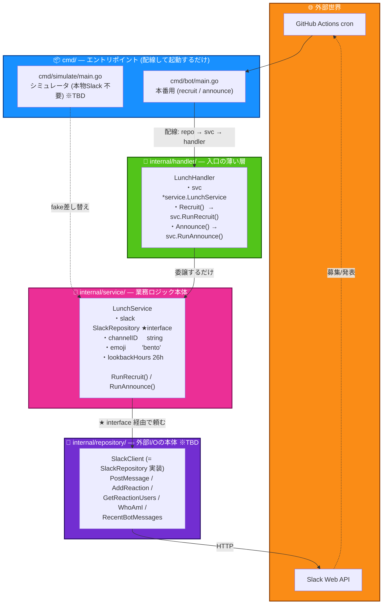
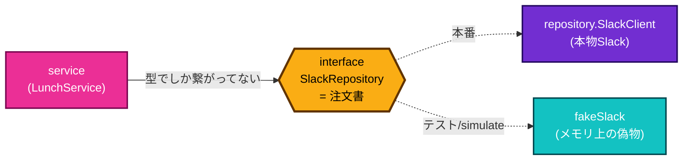
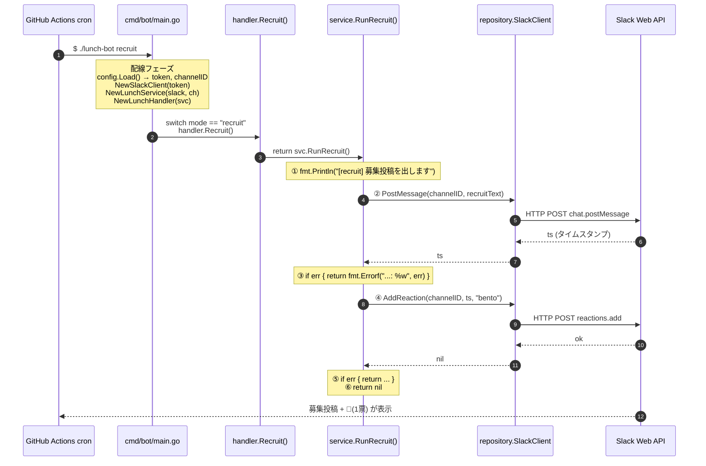
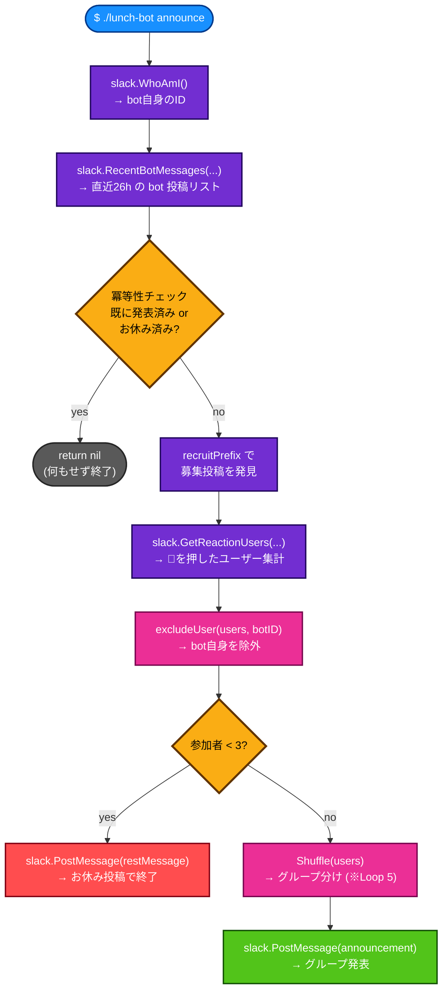
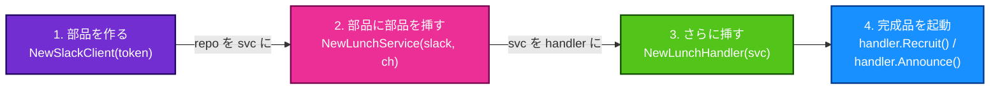
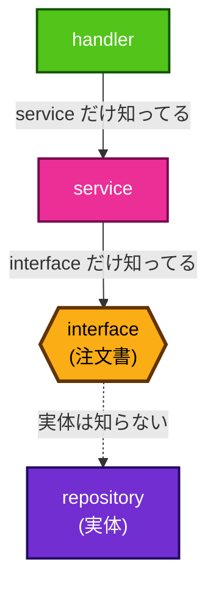
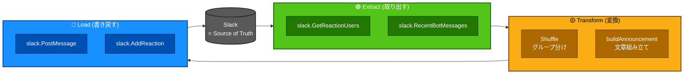

# notes/00_overview.md — 全体俯瞰 (Day 1 Loop 3 前半時点)

このファイルは `lunch-bot` の **全体構造** と **動きの流れ** を1ページで把握するためのまとめ。
Day 3 Loop 8 で ETL対応図 + 設計判断5つ を追記する予定。

> **読了範囲のスナップショット (2026-04-30 時点)**
> - 読んだ: `cmd/bot/main.go` / `internal/config/` / `internal/handler/` / `internal/service/lunch_service.go` の前半 (interface + struct + const + RunRecruit)
> - まだ: `RunAnnounce` / `internal/service/shuffler.go` / `internal/repository/slack_client.go` / `cmd/simulate/main.go`

---

## 1. アーキテクチャ図 (3層レイヤー構造)

### 各層の役割を1行で

| 層 | ファイル | 役割 (1行) |
|---|---|---|
| `cmd/` | `cmd/bot/main.go` | 起動するだけ。引数を見て recruit/announce を分岐 |
| `config/` | `internal/config/config.go` | 環境変数から token と channelID を読む |
| `handler/` | `internal/handler/lunch_handler.go` | 入口。サブコマンドを service に委譲するだけ |
| `service/` | `internal/service/lunch_service.go` | 業務ロジック本体 |
| `repository/` | `internal/repository/slack_client.go` | Slack API を実際に叩く実体 (HTTP) |

### ★ interface (`SlackRepository`) の役割

- 本番: `repository.SlackClient` (本物Slack)
- テスト/simulate: `fakeSlack` (メモリ上の偽物) ← interface があるから差し替え可能

→ これが `cmd/simulate` で本物Slack 無しにロジック検証できる仕組みの土台。

---

## 2. データフロー図 (リクエスト → 処理 → レスポンス)

### A. Recruit フロー (月曜09:00 JST)

エラーは各層で `%w` で包んで上に投げる → 最終的に `cmd/bot/main.go` の `log.Fatalf` で出力 + 非0終了。
GitHub Actions が失敗を検知 → 通知。

### B. Announce フロー (火曜09:00 JST)  ※TBD

明日 Loop 4 で `RunAnnounce` を読む。今は**ざっくり**だけ:

→ Day 2 で詳細を埋める。

---

## 3. 「配線」の比喩 (= 依存性注入 / DI)

`cmd/bot/main.go` でやってることは、**プラモデルの組み立て**:

- 上の層 (handler) は下の層 (repo) のことを **直接知らない**。
- service が間にいて、handler は service だけ知ってる。
- service は repo の実体を知らず、interface (注文書) だけを知ってる。

→ 各層が **すぐ下の層しか知らない** = 関心の分離。

---

## 4. ETL 視点の対応 (※Day 3 Loop 8 で完成させる予定 / 仮置き)

→ lunch-bot は **Slack を Source of Truth として、Slack から読み Slack に書く** ETL ジョブ。
状態をDBに持たない (= ステートレス) のが特徴。

---

## 5. メモ (今日の発見)

- interface の本当のおいしさ: 「型が合えば誰でもOK」 → fake と差し替え可能
- const が prefix と Text に **物理的に分かれてる** のは: ① 絵文字正規化問題 (Unicode↔colon-code) ② 本文を改修しても prefix さえ変えなければ過去投稿検索が壊れない
- `%w` (エラーラッピング) と `%v` の違い: `%w` は元エラーを潰さず封筒に包む → 上位で `errors.Is` 判別可能
- `fmt.Println` の出力先: stdout → ローカルなら端末、GitHub Actions ならワークフローログ
